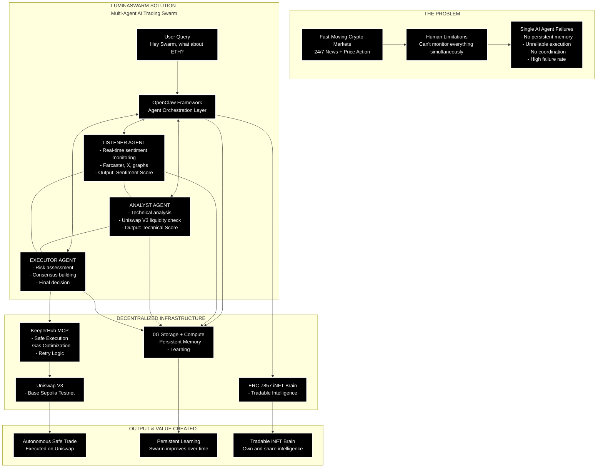

# LuminaSwarm: Autonomous Agent Economy

LuminaSwarm is a decentralized multi-agent system designed for automated market analysis and trade execution. It leverages P2P communication, persistent decentralized memory, and safe intent execution.

## Project Structure

```text
LuminaSwarm/
├── backend/                # Python Fast API & Agents
│   ├── main.py             # Entry point
│   ├── orchestrator.py     # Swarm lifecycle manager
│   ├── agents/             # Autonomous Agents (Listener, Analyst, Executor)
│   ├── services/           # External API integrations (CoinGecko, KeeperHub)
│   ├── core/               # Infrastructure (AXL Bus, 0G Memory)
│   └── utils/              # Shared utilities
├── frontend/               # React (Vite) User Interface
├── contracts/              # Solidity Smart Contracts
└── docs/                   # Documentation
```

## Getting Started


### Backend
1. Install dependencies: `pip install -r backend/requirements.txt`
2. Run the swarm: `python -m backend.main`

### Frontend
1. Navigate to frontend: `cd frontend`
2. Install dependencies: `npm install`
3. Run dev server: `npm run dev`

## Core Technologies
- **Gensyn AXL**: Peer-to-peer agent communication.
- **0G Storage**: Persistent decentralized memory.
- **KeeperHub MCP**: Standardized safe execution layer.
- **CoinGecko**: Real-time market intelligence.


